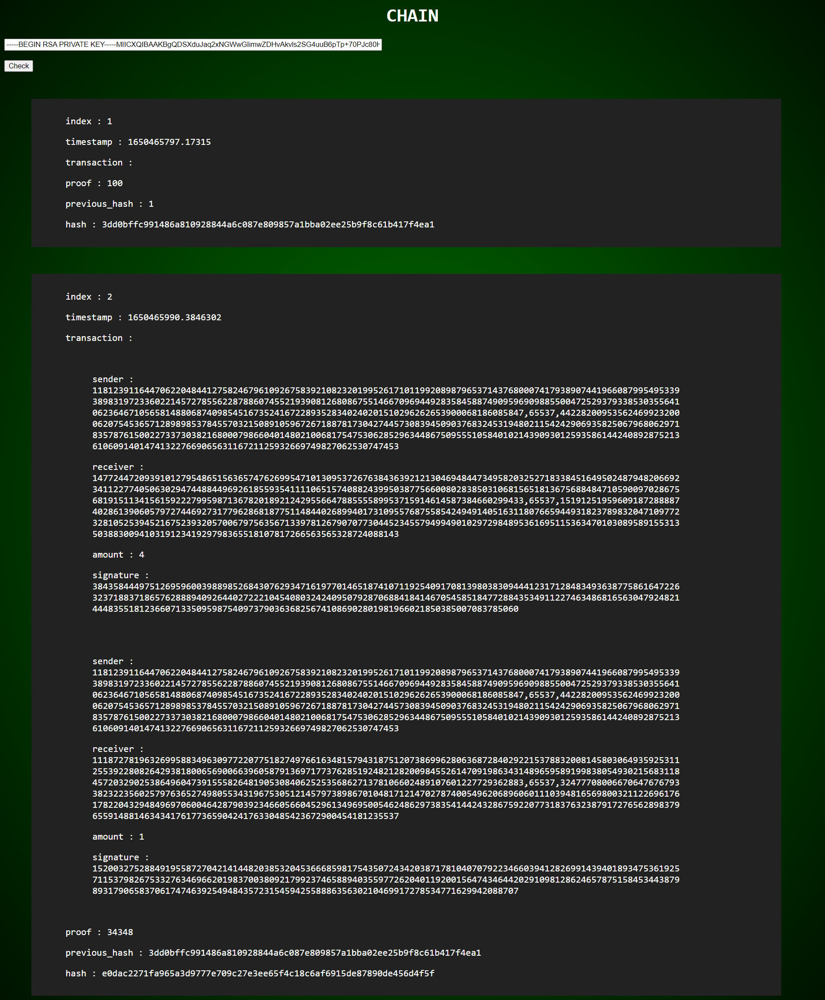

# Blockchain-Powered Framework for Web Application Transactions

## Project Description

This project is a proof of concept of a vehicle rental system utilizing a web application and an associated blockchain to record rental transactions made. The aim is to achieve a trust-less, de-centralized consensus. It involves mining the transaction block and adding it to the chain once the transaction is completed. Data on blockchain is kept secured and distributed on the network. This illustrates practical applications of Blockchain technology in ways that are easy to visualize and understand.

## Team Members
- [@iamgiribabu](https://github.com/iamgiribabu) - Giribabu Anisetti
- [@kingakshat](https://github.com/kingakshat) - Akshat Shirsat
- [@nishantschavan](https://github.com/nishantschavan) - Nishant Chavan
- [@RahulChakravorty](https://github.com/RahulChakravorty) - Rahul Chakravorty

## Transaction Life Cycle
1. Creating transactions
2. Signing with own Private key
3. Encrypting with receiver’s Public key
4. Validating by blockchain network
5. Decrypting with receiver’s Private key
6. Validating signature with sender’s Public key

## Project Application Overview

### 1. Blockchain Application
- Built using Python Django
- Contains API endpoints for:
  - Creating a peer-to-peer network with other nodes
  - Accepting transaction requests from users in JSON data format
  - Mining: validating transaction information and running a proof of work algorithm
  - Consensus: resolving conflicts between nodes to maintain a single valid Blockchain

### 2. Wallet Application
- Django API working with the user webpage frontend
- Maintains a database of users with their login information
- Manages users' private and public keys
- Utilizes RSA digital signatures for transaction verification

### 3. User Webpage - Frontend
- Allows users to:
  - Login and signup
  - Book vehicles
  - Select locations
  - Scan QR codes
  - Unlock vehicles
  - Lock vehicles after reaching the destination

## Algorithms & Mechanisms Used in the Project
- Blockchain Consensus Mechanism
- Peer-to-peer Network
- Digital Signature
- RSA Algorithm for Cryptography
- Web Application development technology: Node.js, React.js, Redux.js

## Contribution
- Contributions and feedback are welcome! If you have suggestions for improvement or found errors, feel free to create pull requests or raise issues.

## Disclaimer
- This project is developed for educational purposes only. Ensure you have appropriate authorization before implementing any techniques or using tools described herein.

## Connect with Us
- Connect with us on GitHub to learn more about our project and our contributions to the field of blockchain technology and web application development.

Happy coding! 🚀
